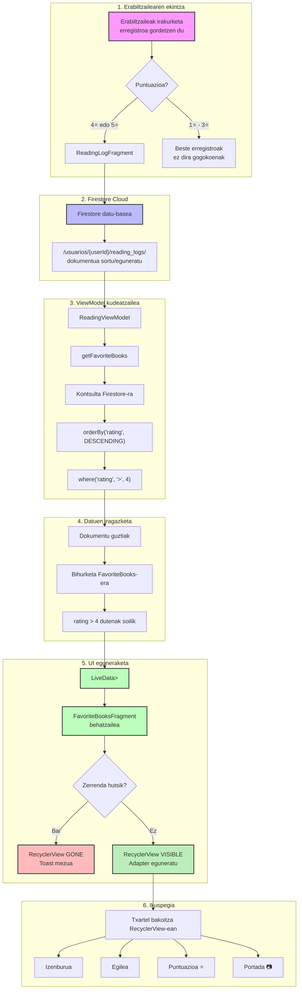

# BOOKJOURNAL ANDROID APP

## EGILEA
- [Ainhize Arrese Ugarte](https://github.com/arreseAinhize)

## AURKIBIDEA
- [Sarrera](#sarrera)
    - [Erabilitako teknologiak](#erabilitako-teknologia)
- [Aplikazioaren ezaugarriak](#aplikazioaren-ezaugarriak)
    - [Autentifikazio sistema](#1-autentifikazio-sistema)
        - [Hasierako Pantaila](#hasierako-pantaila-firstfragment)
        - [Erregistroa](#erregistroa-singupfragment)
        - [Saio-hasiera](#saio-hasiera-loginfragment)
        - [Saio-amaiera](#saio-amaiera-logout)
    - [Nabigazioa eta menuak](#2-nabigazioa-eta-menuak)
    - [Reading Log](#3-irakurketa-egunerokoa-reading-log)
        - [Liburuen Bilaketa](#liburuen-bilaketa-addbooklogfragment)
        - [Emaitzen txartelak](#emaitzen-txartelak-itemsearchbookbinding)
        - [Irakurketaren Datuen Sarrera](#irakurketaren-datuen-sarrera-logbookinfofragment)
        - [Irakurketa Erregistroen Zerrenda](#irakurketa-erregistroen-zerrenda-readinglogfragment)
    - [Reading System](#4-irakurketa-sistema-reading-system)
        - [Atalaren helburua](#atal-honen-helburua)
        - [Pantaila diseinua](#pantailaren-diseinua)
        - [Funtzionamendua](#funtzionamendua)
        - [Firestore-ko egitura](#firestore-ko-egitura)
    - [Wish List](#5-desio-zerrenda-wishlist)
        - [Liburuen bilaketa](#liburuen-bilaketa-searchwishbookfragment)
        - [Desio-zerrendaren kudeaketa](#desio-zerrendaren-kudeaketa-wishlistfragment)
    - [Book Information](#6-liburuen-informazioa-book-information)
        - [Bilaketa](#bilaketa-bookinfofragment)
        - [Emaitza txartelak](#emaitzen-txartelak-itemsearchbookbinding-1)
        - [Sinopsien karga](#sinopsien-karga-bookviewmodel)
        - [Xehetasunen Pantaila](#xehetasunen-pantaila-showbookinfofragment)
    - [Faborite Books](#7-liburu-gogokoenak-favorite-books)
- [Aplikazioko kodearen egitura](#aplikazioko-kodigoaren-egitura)
- [Oharrak](#oharrak)
    - [Lanaren ahulguneak](#lanaren-ahulguneak)
    - [Etorkizunerako hobekuntzak](#etorkizunerako-hobekuntzak)

## SARRERA
BookJournal aplikazioa liburuak irakurtzen dituzten erabiltzaileetan pentsatuz sortutako eguneroko digitala da, Android Studio ingurunean garatutakoa eta Java zein Kotlin programazio-lengoaien bidez eraikia. Helburu nagusia erabiltzaile bakoitzak bere irakurketa ohiturak kontrolatzeko eta hobeto ulertzeko herramienta bat izatea da. Honetarako, aplikazioak erabiltzailearen datuak gordetzen ditu, aurrerago irakurritako liburuen inguruko informazioa jaso eta bistaratzeko.

Aplikazio honen bidez, erabiltzaileek beren irakurketa esperientzia hobeto antolatu dezakete, liburuei puntuazioa eman, desio-zerrendak sortu eta euren irakurketa ohituren gaineko ikuspegi bisual bat izan. Dokumentu honetan, aplikazioaren analisia, diseinua eta garapen-prozesua aurkeztuko ditugu, sortutako funtzionalitate guztiak xehatuz.

### Erabilitako teknologia

| Kategoria | Teknologia | Erabilera |
|-----------|------------|-----------|
| **Lengoaiak** | Java, Kotlin | Programazio-lengoaiak |
| **Garatze ingurunea** | Android Studio | Aplikazioaren garapena |
| **UI diseinua** | XML layouts, ViewBinding | Pantailen diseinua eta elementuen lotura |
| **Nabigazioa** | Android Navigation Component | Fragment-en arteko nabigazioa |
| **Autentikazioa** | Firebase Authentication | Erabiltzaileen kudeaketa (email/password eta Google Sign-In) |
| **Datu basea** | Firebase Firestore | Datuen biltegiratze sinkronizatua |
| **APIak** | Open Library API | Liburuen bilaketa eta informazioa |
| | Open Library WorkDetails API | Liburuen sinopsiak eskuratzeko |
| **Liburutegiak** | Retrofit | API deietarako |
| | Glide | Irudiak kargatzeko |
| | Material Design Components | Material Design estiloak |
| | Credential Manager | Google sign-in modernoa |
| **Gailuaren orientazioa** | Portrait / Landscape | Bi orientazioetarako egokitzapena |

## APLIKAZIOAREN EZAUGARRIAK

### 1. Autentifikazio Sistema
#### Hasierako Pantaila (FirstFragment)
Aplikazioa irekitzean erabiltzaileak ongietorri-pantaila bat aurkitzen du, non bi aukera nagusi eskaintzen diren: saioa hasi edo kontua sortu. Pantaila honek diseinu sinple eta erakargarria du, aplikazioaren logotipoarekin eta izenburuarekin.

<p align="center">  </p>

- Ezaugarri garrantzitsua: **erabiltzailea dagoeneko autentifikatuta badago** (saioa irekita eta Firebase saioa aktibo), aplikazioak automatikoki HomeFragment-era nabigatzen du, hasierako pantaila erakutsi gabe. Honek erabiltzailearen esperientzia hobetzen du, ez baitu etengabe saioa hasi behar.

#### Erregistroa (SingUpFragment)
Erabiltzaile berriek kontua sor dezakete e-posta eta pasahitz bidez:

<p align="center">  </p>

- **E-posta**: Baliozko e-posta helbidea.
- **Pasahitza**: Gutxienez 6 karaktere.
- **Pasahitza errepikatu**: Pasahitzak bat datozela egiaztatzeko.

**Balioztatzeak:**
- Pasahitzak gutxienez 6 karaktere izan behar ditu.
- Pasahitzak berdinak izan behar dira.
- Eremu guztiak bete behar dira.

**Errore-mezuak:**
- "Pasahitzak ez datoz bat".
- "Pasahitzak gutxienez 6 karaktere izan behar ditu".

Erregistroa ondo burutzean, Firebase Authentication-en erabiltzailea sortzen da eta Firestore-n erabiltzailearen dokumentua automatikoki sortzen da.

#### Saio-hasiera (LogInFragment)

<p align="center">  </p>

Bi autentikazio-metodo eskaintzen dira:

**1. E-posta eta pasahitzarekin:**
Erabiltzaileak bere kredentzialak sartzen ditu eta "Login" botoian klik egiten du. Firebase Authentication-ek balioztatzen ditu kredentzialak.

**2. Google kontuarekin:**
Android-en **Credential Manager** erabiliz inplementatuta (deprecatutako GoogleSignInClient-en ordez). Abantailak:
- Segurtasun handiagoa.
- Erabiltzaileak gailuan dituen Google kontuak automatikoki detektatzen ditu.
- UI moderno eta integratua.

**Google sign-in fluxua:**
1. Erabiltzaileak "Login with Google" botoian klik egiten du.
2. Credential Manager-ek gailuko Google kontuen zerrenda erakusten du.
3. Erabiltzaileak kontu bat hautatzen du.
4. Google ID token-a lortzen da.
5. Firebase GoogleAuthProvider-rekin autentifikatzen da.
6. Firestore-n erabiltzailearen dokumentua sortzen da (beharrezkoa bada).

**Kasu bereziak:**
- Gailuan Google konturik ez badago, erabiltzaileari mezua erakusten zaio eta kontu bat gehitzera bideratzen da.
- Autentifikazioa ezeztatzen bada, errore-mezu argia erakusten da.

#### Saio-amaiera (Logout)

Aplikazioaren edozein atal nagusitatik egin daiteke saio-amaiera. **LogoutManager.kt** objektuak kudeatzen du prozesu hau:

```kotlin
// LogoutManager.kt-ren funtzionamendua:
1. Credential Manager-en egoera garbitu.
2. FirebaseAuth signOut() deitu.
3. Toast mezua erakutsi.
4. Nabigatu hasierako pantailara (FirstFragment).
```
Baieztapena eskatzen da saioa amaitu baino lehen, nahi gabeko amaierak saihesteko:

<p align="center">  </p>

### 2. Nabigazioa eta Menuak
Aplikazioak nabigazio-sistema malgua eta intuitiboa du, gailuaren orientazioaren arabera egokitzen dena.

**Nabigazioaren Egitura**
NavGraph-ak 13 fragment ditu, ondorengo moduan antolatuta:
```text
fristFragment (hasiera)
    ├── logInFragment
    │     └── homeFragment
    └── singUpFragment
          └── homeFragment
                ├── readingLogFragment
                │     ├── addBookLogFragment
                │     │     └── logBookInfoFragment
                │     └── logBookInfoFragment
                ├── readingSystemFragment
                ├── wishListFragment
                │     └── searchWishBookFragment
                ├── bookInfoFragment
                │     └── showBookInfoFragment
                └── favoriteBooksFragment
```

**Menu Nagusiak**
<p align="center">  </p>

- Bottom Navigation (bertikala - portrait):

<p align="center">  </p>

5 atal nagusiak azkar aldatzeko:
    - Irakurketa egunerokoa
    - Estatistikak
    - Desio-zerrenda
    - Liburu informazioa
    - Gogokoenak

- Navigation Drawer (horizontala - landscape):
<p align="center">  </p>

Orientazio horizontalean, Bottom Navigation desagertu eta FAB bat agertzen da alboko menua irekitzeko. Diseinu honi esker pantaila horizontalki dagoeneko eremuak aprobetxatzen dira.

**FAB funtzioa:**

FAB-a sakatzean, Navigation Drawer irekitzen da, atal nagusietara sarbide azkarra emanez.

**Nabigazioaren Kudeaketa (MainActivity)**
`MainActivity.java`-k nabigazioa kontrolatzen du, fragment motaren arabera menuak erakutsi eta ezkutatzen:

```java
navController.addOnDestinationChangedListener((controller, destination, arguments) -> {
    int destId = destination.getId();

    // Fragment nagusiak (menuak ikusgai)
    if (destId == R.id.readingLogFragment ||
        destId == R.id.readingSystemFragment ||
        destId == R.id.wishListFragment ||
        destId == R.id.bookInfoFragment ||
        destId == R.id.favoriteBooksFragment) {
        
        updateMenuVisibilityByOrientation(); // Orientazioaren arabera
        drawerLayout.setDrawerLockMode(DrawerLayout.LOCK_MODE_UNLOCKED);
    
    // Autentikazio fragment-ak (menuak ezkutuan)
    } else if (destId == R.id.fristFragment ||
               destId == R.id.logInFragment ||
               destId == R.id.singUpFragment) {
        
        bottomNavView.setVisibility(View.GONE);
        fabMenu.setVisibility(View.GONE);
        drawerLayout.setDrawerLockMode(DrawerLayout.LOCK_MODE_LOCKED_CLOSED);
    }
});
```

**Orientazio-aldaketa automatikoa:**
```java
public void onConfigurationChanged(@NonNull Configuration newConfig) {
    super.onConfigurationChanged(newConfig);
    
    if (fragment nagusietan bagaude) {
        updateMenuVisibilityByOrientation();
    }
}

private void updateMenuVisibilityByOrientation() {
    if (getResources().getConfiguration().orientation == Configuration.ORIENTATION_LANDSCAPE) {
        bottomNavView.setVisibility(View.GONE);
        fabMenu.setVisibility(View.VISIBLE);  // FAB agertu
    } else {
        bottomNavView.setVisibility(View.VISIBLE);
        fabMenu.setVisibility(View.GONE);     // FAB ezkutatu
    }
}
```

### 3. Irakurketa Egunerokoa (**Reading Log**)
Atal honetan erabiltzaileak irakurritako liburuak erregistratu ditzake, irakurketaren datu guztiekin.

<p align="center">  </p>
<p align="center">  </p>

#### Liburuen Bilaketa (`AddBookLogFragment`):
***Open Library API*** erabiliz, erabiltzaileak liburuak bilatu ditzake izenburuaren arabera:

- *Bilaketa automatikoa* hasten da 3 karaktere idaztean
- *Debounce mekanismoa:* 1 segundoko atzerapena idazketaren amaieratik bilaketa exekutatu arte, API deiak optimizatzeko
- *Emaitzak* RecyclerView batean erakusten dira

#### Emaitzen txartelak (`ItemSearchBookBinding`):
<p align="center">  </p>
Txartel bakoitzak erakusten du:
    - Liburuaren azala (Glide-rekin kargatua).
    - Izenburua.
    - Egilea(k).
    - "Gehitu" botoia.

**Bilaketa-kodea:**
```java
private void setupSearchView() {
    binding.text.setOnQueryTextListener(new SearchView.OnQueryTextListener() {
        @Override
        public boolean onQueryTextChange(String s) {
            clearPendingSearches();
            
            if (s != null && s.trim().length() >= 3) {
                searchRunnable = () -> bookViewModel.search(s.trim());
                searchHandler.postDelayed(searchRunnable, 1000);
            }
            return false;
        }
    });
}
```

#### Irakurketaren Datuen Sarrera (`LogBookInfoFragment`)
Liburua hautatu ondoren, erabiltzaileak irakurketaren datu guztiak betetzen ditu formulario batean:

<p align="center">  </p>

**Datuak:**
    - *Hasiera data eta Amaiera data:* DatePicker dialog bidez hautatzen dira.
    - *Irakurketa mota:* Testu librekoa (fisikoa, digitala, audioa...).
    - *Puntuazioa:* 5 izarreko sistema interaktiboa (Reading System atalarekin zerikuzia duena). 
    - *Oharrak:* Liburuaren inguruko oharrak idazteko eremua.

**DatePicker inplementazioa:**
```java
private void showDatePicker(boolean isStartDate) {
    Calendar calendar = Calendar.getInstance();
    
    DatePickerDialog datePickerDialog = new DatePickerDialog(
            requireContext(),
            (view, year, month, dayOfMonth) -> {
                String selectedDate = String.format("%02d/%02d/%d", 
                        dayOfMonth, month + 1, year);
                
                if (isStartDate) {
                    binding.sDateValue.setText(selectedDate);
                } else {
                    binding.eDateValue.setText(selectedDate);
                }
            },
            calendar.get(Calendar.YEAR),
            calendar.get(Calendar.MONTH),
            calendar.get(Calendar.DAY_OF_MONTH)
    );
    datePickerDialog.show();
}
```

**Puntuazio-sistema:**
    *5 izarreko puntuazio-sistema*
```java
private void setRating(int rating) {
    selectedRating = rating;
    
    for (int i = 0; i < starButtons.size(); i++) {
        ImageButton starButton = starButtons.get(i);
        if (i < rating) {
            starButton.setImageResource(R.drawable.ic_star_filled_24dp);
        } else {
            starButton.setImageResource(R.drawable.ic_star_border_24dp);
        }
    }
}
```

**Balioztatzeak gorde aurretik:**
- Puntuazioa hautatu behar da.
- Hasiera data bete behar da.
- Amaiera data bete behar da.
- Amaiera data ezin da hasiera data baino lehenagokoa izan.

#### Irakurketa Erregistroen Zerrenda (`ReadingLogFragment`):

Erregistro bakoitzak erakusten du:
- Liburuaren azala.
- Izenburua eta egilea.
- Hasiera eta amaiera datak.
- Puntuazioa.
- "Editatu" botoia.

**Firestore-ko egitura:**
```text
usuarios/{userId}/reading_logs/{documentId}
    - title: String
    - author: String
    - isbn: String
    - genre: String
    - imageUrl: String
    - bookId: String
    - startDate: String
    - endDate: String
    - lectureType: String
    - rating: int
    - notes: String
    - userId: String
    - timestamp: long
```

**Edizioa**
Erregistro bat editatzean, datuak automatikoki kargatzen dira formularioan eta aurretik "Save" zen botoia "Update" bihurtzen da. Aldaketak gordetzean, Firestore-n dokumentuaren eguneraketa gertatzen da.

### 4. Irakurketa Sistema (**Reading System**)
Atal honek erabiltzaileari aukera ematen dio **puntuazio (izar) bakoitzari balio pertsonalizatu bat esleitzeko**.

<p align="center">  </p>
<p align="center">  </p>

#### Atal honen helburua

Erabiltzaileak bere irakurketa-sistema propioa definitu dezake, non izar kopuru bakoitzak esanahi edo balio pertsonal bat duen. Adibidez:

- ⭐ = "Ez dut bat ere gomendatzen" 
- ⭐⭐ = "ez zait gustiz gustatu"
- ⭐⭐⭐ = "Ez dago gaixki"
- ⭐⭐⭐⭐ = "Gustatu zait"
- ⭐⭐⭐⭐⭐ = "Oso gomendagarria berriz irakurriko nuke"

#### Pantailaren diseinua

*Irakurketa Sistema pantaila*

Pantaila bi zati nagusitan banatzen da:

**Ezkerraldea - Izarren balioak:**
- ⭐ 1 izarraren balioa (testu gisa)
- ⭐⭐ 2 izarren balioa
- ⭐⭐⭐ 3 izarren balioa
- ⭐⭐⭐⭐ 4 izarren balioa
- ⭐⭐⭐⭐⭐ 5 izarren balioa

*Izar bakoitzari esleitutako balioak*

**Eskuinaldea - Datuak aldatzeko panela:**
- **Spinner-a**: 1-5 izarrak hautatzeko.
- **Testu-eremua**: Balio berria sartzeko (edozein testu).
- **"Edit Value" botoia**: Aldaketa gordetzeko.

#### Funtzionamendua

1. **Spinner-ean** izar kopurua hautatzen da (1 ⭐, 2 ⭐, 3 ⭐, 4 ⭐ edo 5 ⭐)
2. **Testu-eremuan** balio berria idazten da (adibidez, "Erraza", "Konplexua", "20 egun", etab.)
3. **"Edit Value" botoia** sakatzean:
   - Hautatutako izarraren balioa eguneratzen da
   - Firestore-n gordetzen da
   - Pantailako testua automatikoki eguneratzen da

```java
private void updateStarValue(String star, String newValue) {
    switch (star) {
        case "1 ⭐":
            readingData.setStar1Value(newValue);
            txtStar1.setText(newValue);
            break;
        case "2 ⭐":
            readingData.setStar2Value(newValue);
            txtStar2.setText(newValue);
            break;
        // ... 3, 4, 5 izarrentzat ere bai
    }
    saveReadingSystemData();
}
```

#### Firestore-ko egitura
Datuak Firebase Firestore-n gordetzen dira, erabiltzaile bakoitzarentzat:
```text
usuarios/{userId}/reading_system/stats
    ├── star1Value: String  // "Koaderno txikia"
    ├── star2Value: String  // "Eleberri laburra"  
    ├── star3Value: String  // "Saiakera"
    ├── star4Value: String  // "Nobela historikoa"
    ├── star5Value: String  // "Klasikoa"
    ├── updatedAt: long     // 1705357200000
    └── userId: String      // "abc123..."
```


### 5. Desio-zerrenda (**Wishlist**)
Erabiltzaileek irakurri nahi dituzten liburuak gorde ditzakete zerrenda honetan, geroago erosteko edo irakurtzeko asmoz.

<p align="center">  </p>
<p align="center">  </p>

#### Liburuen Bilaketa (`SearchWishBookFragment`)
*Desio-zerrendarako liburuen bilaketa*

Irakurketa egunerokoaren antzeko bilaketa-sistema, baina helburua desberdina da: hemen liburuak gordetzen dira desio-zerrendan, ez irakurritakoen erregistroan.

**Bilaketa-ezaugarriak:**
- **Bilaketa automatikoa**: 3 karaktere idaztean abiarazten da.
- **Debounce sistema**: 1 segundoko itxaron-denbora idazketaren amaieratik (API deiak optimizatzeko).
- **Emaitzak RecyclerView-ean**: Txartel bakoitzean azala, izenburua eta egilea(k).

<p align="center">  </p>

*Bilaketa-emaitzen txartela*

**Txartelaren elementuak:**
- **Azala**: Glide-rekin kargatua (errorerako eta placeholder-erako irudi lehenetsiekin).
- **Izenburua**: Open Library-tik lortua.
- **Egilea(k)**: Egile bakarra edo bat baino gehiago koma bidez banatuta.
- **"Gehitu" botoia**: Liburua desio-zerrendan gordetzeko.

```java
// Egileak formateatzeko
if (volumeInfo.authors != null && !volumeInfo.authors.isEmpty()) {
    StringBuilder authorsText = new StringBuilder();
    for (String author : volumeInfo.authors) {
        if (authorsText.length() > 0) authorsText.append(", ");
        authorsText.append(author);
    }
    holder.binding.authorID.setText(authorsText.toString());
}
```

**Gordetze-prozesua**
Erabiltzaileak "Gehitu" botoian klik egitean:

1. WishlistItem objektua sortzen da:
```java
WishlistItem wishlistItem = new WishlistItem(
        volumeInfo.title,
        volumeInfo.authors,
        volumeInfo.coverImage,
        currentUser.getUid()
);
```

2. Firestore-n gordetzen da:
```java
db.collection("usuarios")
        .document(currentUser.getUid())
        .collection("wishlist")
        .add(wishlistItem)
        .addOnSuccessListener(documentReference -> {
            wishlistItem.setId(documentReference.getId());
            wishlistViewModel.addWishlistItem(wishlistItem);
            Toast.makeText(requireContext(), R.string.book_saved, Toast.LENGTH_SHORT).show();
        });
```

3. **ViewModel eguneratzen da**: `WishlistViewModel`-eko lista eguneratzen da eta behatzaileei jakinarazten zaie.

4. **Toast mezua:** "Liburua gorde da" mezua erakusten da.

#### Desio-zerrendaren Kudeaketa (`WishListFragment`)
![] Desio-zerrenda

**Elementu bakoitzak erakusten du:**
- **Azala:** Glide-rekin kargatua.
- **Izenburua:** Letra lodiz nabarmendua.
- **Egilea(k):** Egilearen izena(k).
- **"Ezabatu" botoia:** Elementua zerrendatik kentzeko.

`WishlistAdapter`-ak kudeatzen du RecyclerView:
```java
public class WishlistAdapter extends RecyclerView.Adapter<WishlistAdapter.WishlistViewHolder> {
    
    public interface OnDeleteClickListener {
        void onDeleteClick(WishlistItem item, int position);
    }
    
    @Override
    public void onBindViewHolder(@NonNull WishlistViewHolder holder, int position) {
        WishlistItem item = wishlistItems.get(position);
        
        // Ezabatu botoiaren listenerra
        holder.binding.btnWishDelete.setOnClickListener(v -> {
            if (deleteListener != null) {
                deleteListener.onDeleteClick(item, position);
            }
        });
        
        // Item osoaren klik listenerra
        holder.itemView.setOnClickListener(v -> {
            if (itemClickListener != null) {
                itemClickListener.onItemClick(item);
            }
        });
    }
}
```

**Elementua ezabatzea**
Ezabatze-prozesua segurtasunez diseinatuta dago:

<p align="center">  </p>

1. Erabiltzaileak "Ezabatu" botoian klik egiten du
2. Baieztapen-dialogoa agertzen da:
    - Izenburua: "Ezabatu"
    - Mezua: "Ziur zaude [liburuaren izena] ezabatu nahi duzula?"
    - "Bai" eta "Ez" botoiak
3. "Bai" sakatzean:
```java
private void deleteItemFromFirestore(WishlistItem item, int position) {
    db.collection("usuarios")
            .document(currentUser.getUid())
            .collection("wishlist")
            .document(item.getId())
            .delete()
            .addOnSuccessListener(aVoid -> {
                adapter.removeItem(position);
                wishlistViewModel.removeItem(position);
                Toast.makeText(requireContext(), 
                        R.string.delete_success, 
                        Toast.LENGTH_SHORT).show();
            });
}
```
4. Emaitza:
    - Firestore-tik dokumentua ezabatzen da
    - RecyclerView-etik elementua kentzen da (animazioarekin)
    - Toast mezua: "Ezabatuta!"
    - ViewModel-eko lista eguneratzen da

**Firestore-ko egitura**
```text
usuarios/
   └─ {userId}/
       └─ wishlist/
           └─ {documentId}/
               ├── title: String
               ├── authors: List<String>
               ├── coverImage: String
               └── userId: String
```

**Datuen karga hasieratzean**
Fragment-a irekitzean, datuak automatikoki kargatzen dira:
```java
private void loadWishlistItemsFromFirestore() {
    db.collection("usuarios")
            .document(currentUser.getUid())
            .collection("wishlist")
            .get()
            .addOnSuccessListener(queryDocumentSnapshots -> {
                List<WishlistItem> items = new ArrayList<>();
                for (DocumentSnapshot document : queryDocumentSnapshots) {
                    WishlistItem item = document.toObject(WishlistItem.class);
                    item.setId(document.getId());
                    items.add(item);
                }
                wishlistViewModel.setWishlistItems(items);
            });
}
```

### 6. Liburuen Informazioa (**Book Information**)
Atal honetan erabiltzaileek edozein libururi buruzko informazio zehatza bilatu eta ikusi dezakete, inongo erregistrorik egin gabe. Ezinbesteko tresna da liburu bat erosi edo irakurri aurretik informazioa eskuratzeko.

<p align="center">  </p>
<p align="center">  </p>

#### Bilaketa (`BookInfoFragment`)

**Bilaketa-funtzionalitateak:**
- Bilaketa automatikoa: 3 karaktere baino gehiago idaztean aktibatzen da
- Debounce: 1 segundoko atzerapena, API deiak optimizatzeko
- Emaitzak RecyclerView-ean: Txartel bakoitzak liburu baten informazioa erakusten du

<p align="center">  </p>

#### Emaitzen txartelak (`ItemSearchBookBinding`):
- *Azala:* Glide-rekin kargatua, cache estrategiarekin (`DiskCacheStrategy.ALL`).
- *Izenburua:* Letra lodiz nabarmendua.
- *Egilea(k):* Egile zerrenda.
- *"Select" botoia:* Xehetasunak ikusteko.

#### Sinopsien Karga (`BookViewModel`)
Liburu bakoitzaren sinopsia kargatzea da atal honen ezaugarri nagusietako bat. Open Library-ren WorkDetails APIa erabiltzen da horretarako:

```java
public void fetchSynopsis(String key, Book.VolumeInfo volumeInfo) {
    // Markatu kargatzen ari dela
    Map<String, String> currentMap = synopsisMap.getValue();
    currentMap.put(volumeInfo.title, "Kargatzen...");
    synopsisMap.postValue(currentMap);
    
    // API deia
    Book.api.getWorkDetails(key).enqueue(new Callback<Book.WorkDetails>() {
        @Override
        public void onResponse(@NonNull Call<Book.WorkDetails> call, 
                               @NonNull Response<Book.WorkDetails> response) {
            if (response.isSuccessful() && response.body() != null) {
                String synopsis = response.body().getDescriptionText();
                if (synopsis != null && !synopsis.isEmpty()) {
                    map.put(volumeInfo.title, synopsis);
                } else {
                    map.put(volumeInfo.title, "Sinopsirik ez");
                }
            }
        }
    });
}
```

**Open Library-ren erantzun-egitura:**
```json
{
  "title": "Gerra eta Bakea",
  "description": "Nobelaren sinopsia hemen...",
  "subjects": ["Nobela", "Errusia", "Gerra"],
  "covers": [123456, 789012]
}
```

**Sinopsia lortzeko logika:**
```java
public String getDescriptionText() {
    if (description == null) return null;
    
    // Kasu 1: String zuzena bada
    if (description instanceof String) {
        return (String) description;
    }
    
    // Kasu 2: Objektua bada "value" eremuarekin
    if (description instanceof Map) {
        Map<String, Object> descMap = (Map<String, Object>) description;
        Object value = descMap.get("value");
        if (value instanceof String) {
            return (String) value;
        }
    }
    
    return null;
}
```

**Sinopsien Mapa eta LiveData**
`BookViewModel`-ek `synopsisMap` bat mantentzen du, non liburuaren izenburua sinopsiarekin lotzen den:
```java
private MutableLiveData<Map<String, String>> synopsisMap = new MutableLiveData<>(new HashMap<>());

public MutableLiveData<Map<String, String>> getSynopsisMap() {
    return synopsisMap;
}
```

- **Honek abantaila hauek ditu:**
    - Sinopsiak cachean gordetzen dira.
    - Liburu bera berriro ikustean, ez da API dei berririk egiten.
    - Fragment-ek sinopsien aldaketak behatu ditzakete.

#### Xehetasunen Pantaila (`ShowBookInfoFragment`)
<p align="center">  </p>

Erabiltzaileak "Select" botoian klik egitean, `ShowBookInfoFragment` irekitzen da, liburuaren informazio guztiarekin:

**Bundle bidez pasatako datuak:**
```java
Bundle bundle = new Bundle();
bundle.putString("book_title", volumeInfo.title);
bundle.putStringArray("book_authors", volumeInfo.authors.toArray(new String[0]));
bundle.putString("book_cover", volumeInfo.coverImage);
bundle.putString("book_published", volumeInfo.publishedDate);
bundle.putString("book_isbn", volumeInfo.isbns.get(0));
bundle.putString("book_synopsis", synopsis);
```
Android-en fragment-en arteko komunikaziorako hainbat metodo daude, baina kasu honetarako Bundle erabiltzeak abantaila garrantzitsuak ditu:

1. Fragment-en izaera independentea: Bundle bat erabiltzean, fragment-ek ez dute elkarren erreferentziak gorde behar, independenteak dira eta birsor daitezke.

2. Birsortze-prozesuetan iraunkortasuna: Android-en gerta daitezkeen egoera-aldaketetan (pantailaren biratzea, hizkuntza-aldaketa, memoriaren kudeaketa) datuak ez dira galtzen, savedInstanceState-en bidez berreskuratzen da.

3. Android-en diseinu-filosofia: Google-k gomendatzen duen modua da fragment-en arteko komunikaziorako:

> "You should pass only the minimum required data between fragments using Bundle arguments." - Android Developers 
    
- *Zergatik?*
    - Mantentze erraza: Datu-fluxua argia eta dokumentatua dago.
    - Testeagarritasuna: Fragment-ak isolatuta proba daitezke.
    - Modularitatea: Fragment-ek ez dute elkarren implementazio-ezagutzarik behar.

**Goiko zatia - CardView nagusia:**
- Azala: Tamaina handian, ezkerrean
- Izenburua: Letra lodiz
- Egilea(k): Egilearen izenak
- ISBN: Nazioarteko zenbaki normalizatua
- Argitaratze-urtea: Lehen argitaratzearen data

***Beheko zatia - Sinopsia:***

- Sinopsia: Testu luzea, ScrollView batean irakurterraza izateko.
- Liburuaren deskribapen osoa, Open Library-tik eskuratua.
```xml
<ScrollView
    android:layout_width="match_parent"
    android:layout_height="match_parent">
    
    <TextView
        android:id="@+id/tvSinopsis"
        android:layout_width="match_parent"
        android:layout_height="wrap_content"
        android:lineSpacingExtra="2dp" />
</ScrollView>
```

***Kudeaketa eta Memoria***
`OnDestroyView` metodoa erabiltzen da memory leak-ak saihesteko:
```java
@Override
public void onDestroyView() {
    super.onDestroyView();
    binding = null; // Binding-a askatu
}
```

### 7. Liburu Gogokoenak (**Favorite Books**)
Atal honek automatikoki erakusten ditu erabiltzaileak 4 eta 5 izarrekin baloratu dituen liburuak. Berezitasun nagusia: ***ez da eskuz kudeatzen***, irakurketa-erregistroetatik automatikoki sortzen da.

<p align="center">  </p>

#### Funtzionamendu Automatikoa

Nola funtzionatzen duen:
```java
// 1. Erabiltzaileak irakurketa-erregistro bat gordetzen du 4-5 izarrekin
ReadingLog newLog = new ReadingLog();
newLog.setTitle("Gerra eta Bakea");
newLog.setRating(5);  // 5 izar
readingViewModel.saveReadingLog(newLog);

// 2. FavoriteBooksFragment-ek automatikoki detektatzen du
public LiveData<List<FavoriteBooks>> getFavoriteBooks(String userId) {
    db.collection("usuarios")
            .document(userId)
            .collection("reading_logs")
            .orderBy("rating", Query.Direction.DESCENDING)
            .get()
            .addOnCompleteListener(task -> {
                List<FavoriteBooks> favBooks = new ArrayList<>();
                for (QueryDocumentSnapshot document : task.getResult()) {
                    FavoriteBooks favBook = document.toObject(FavoriteBooks.class);
                    if (favBook.getRating() > 4) {  // 4 eta 5 izarrekoak soilik
                        favBook.setDocumentId(document.getId());
                        favBooks.add(favBook);
                    }
                }
                favsLiveData.setValue(favBooks);  // 3. UI eguneratu
            });
}
```

#### Datuen fluxua


#### ReadingLog-etik FavoriteBooks-era
*ReadingLog* objektuak datu hauek ditu:
```java
public class ReadingLog {
    private String title;        // "Gerra eta Bakea"
    private String author;       // "Lev Tolstoi"
    private String isbn;         // "978-84-1234-56-7"
    private String genre;        // "Nobela"
    private String imageUrl;     // "https://..."
    private String bookId;       // "/works/OL15395W"
    private int rating;          // 5
    // ... beste eremuak
}
```

*FavoriteBooks* objektuak soilik beharrezkoak diren eremuak gordetzen ditu:
```java
public class FavoriteBooks {
    private String title;        // "Gerra eta Bakea"
    private String author;       // "Lev Tolstoi"
    private String imageUrl;     // "https://..."
    private String bookId;       // "/works/OL15395W"
    private int rating;          // 5
    private String userId;       // "abc123..."
    private String documentId;   // Firestore ID-a
}
```

#### Pantailaren diseinua
![] Gogoko liburuaren txartela

`FavoriteBooksFragment`-aren layout-a:
```xml
<FrameLayout>
    <LinearLayout>
        <!-- Status bar -->
        <LinearLayout android:height="45dp" />
        
        <LinearLayout android:padding="16dp">
            <!-- Header -->
            <LinearLayout>
                <Button android:id="@+id/btnLogOut" />
                <TextView android:text="@string/favorites_book_title" />
            </LinearLayout>
            
            <!-- RecyclerView -->
            <androidx.recyclerview.widget.RecyclerView
                android:id="@+id/recyclerviewFBcontents"
                app:layoutManager="androidx.recyclerview.widget.GridLayoutManager"
                app:spanCount="1" />  <!-- portrait: 1 zutabe -->
        </LinearLayout>
    </LinearLayout>
</FrameLayout>
```

`ItemFavoriteBookBinding` txartelaren egitura:
```xml
<androidx.cardview.widget.CardView>
    <LinearLayout android:orientation="horizontal">
        <!-- Azala -->
        <LinearLayout android:layout_width="100dp">
            <ImageView android:id="@+id/image2" />
        </LinearLayout>
        
        <!-- Informazioa -->
        <LinearLayout android:orientation="vertical">
            <TextView android:id="@+id/titleID" />     <!-- Izenburua -->
            <TextView android:id="@+id/authorID" />    <!-- Egilea -->
            
            <!-- Puntuazioa -->
            <LinearLayout>
                <TextView text="⭐ " />
                <TextView android:id="@+id/ratingID" /> <!-- 4/5 edo 5/5 -->
            </LinearLayout>
        </LinearLayout>
    </LinearLayout>
</androidx.cardview.widget.CardView>
```

## APLIKAZIOKO KODIGOAREN EGITURA
```text
eus.arreseainhize.bookjounal/
│
├── MainActivity.java # Aktivitate nagusia (menuak, nabigazioa)
│
├── fragments/
│ ├── auth/
│ │ ├── FristFragment.java # Ongietorri pantaila
│ │ ├── LogInFragment.java # Saio-hasiera (Google + email)
│ │ └── SingUpFragment.java # Erregistroa
│ │
│ ├── home/
│ │ └── HomeFragment.java # Hasiera menua
│ │
│ ├── reading/
│ │ ├── ReadingLogFragment.java # Irakurketa erregistroak
│ │ ├── AddBookLogFragment.java # Liburua bilatu eta gehitu
│ │ ├── LogBookInfoFragment.java # Irakurketa datuak bete
│ │ └── ReadingSystemFragment.java # Estatistikak
│ │
│ ├── wishlist/
│ │ ├── WishListFragment.java # Desio-zerrenda
│ │ └── SearchWishBookFragment.java # Liburuak bilatu
│ │
│ ├── books/
│ │ ├── BookInfoFragment.java # Liburu informazioa bilatu
│ │ ├── ShowBookInfoFragment.java # Xehetasunak ikusi
│ │ └── FavoriteBooksFragment.java # Gogokoenak
│ │
│ └── adapters/
│ ├── WishlistAdapter.java # Wishlist RecyclerView adapterra
│ └── StarRatingAdapter.java # Izarren spinnerra
│
├── viewmodels/
│ ├── BookViewModel.java # Open Library API
│ ├── ReadingViewModel.java # Irakurketa logika
│ ├── UserViewModel.java # Erabiltzailearen egoera
│ └── WishlistViewModel.java # Wishlist logika
│
├── models/
│ ├── Book.java # Open Library modeloak
│ ├── ReadingLog.java # Irakurketa erregistroa
│ ├── ReadingSystem.java # Estatistika datuak
│ ├── WishlistItem.java # Desio-zerrendako elementua
│ ├── FavoriteBooks.java # Gogoko liburua
│ └── User.java # Erabiltzailea
│
├── utils/
│ ├── FirebaseAuthHelper.java # Firebase Auth utilitateak
│ ├── FirestoreHelper.java # Firestore funtzioak
│ ├── FirestoreOfflineHelper.java # Offline sinkronizazioa
│ ├── GoogleSignInHelper.kt # Google sign-in Kotlin-ean
│ ├── LogoutManager.kt # Saio-amaiera kudeatzailea
│ ├── StringResourceHelper.java # String baliabideak
│ └── SharedPreferencesHelper.java # (Erabili gabe)
│
└── res/
├── layout/ # XML layout fitxategiak
│ ├── activity_main.xml
│ ├── fragment_.xml (14 fitxategi)
│ ├── item_.xml (5 fitxategi)
│ └── nav_header.xml
├── menu/
│ ├── bottom_menu.xml
│ └── drawer_menu.xml
├── navigation/
│ └── nav_graph.xml
├── drawable/ # Irudi eta baliabideak
└── values/ # String, kolore eta estiloak
```

## OINARRIZKO FUNTZIONAMENDUA
### Autentikazio-fluxua
1. **FristFragment**: Erabiltzailea autentifikatuta badago, zuzenean HomeFragment-era nabigatzen da.
2. **LogInFragment**: 
   - Email/password bidezko saio-hasiera
   - Google sign-in Credential Manager bidez
3. **SingUpFragment**: Erabiltzaile berria sortu
4. **Firestore**: Autentikazioaren ondoren, erabiltzailearen dokumentua sortzen da "usuarios" bilduman

### Nabigazioaren kudeaketa
- **MainActivity**: NavController-aren bidez fragment-en arteko nabigazioa kontrolatzen du
- **Destination Change Listener**: Fragment motaren arabera menuak ezkutatu/erakutsi:
  - Fragment nagusiak (readingLog, readingSystem, etc.) → BottomNav eta FAB erakutsi
  - Autentikazio fragment-ak → Menu guztiak ezkutatu
- **Orientazio aldaketa**: onConfigurationChanged() metodoak menuak eguneratzen ditu

### Open Library API integrazioa
1. **BookViewModel.search()**: Liburuak bilatzen ditu search.json endpoint-ean
2. **BookViewModel.fetchSynopsis()**: WorkDetails eskatzen ditu sinopsia lortzeko
3. **Retrofit**: API deiak egiteko erabiltzen da

### Firestore datu-egitura
```text
usuarios/
└─ {userId}/
├─ reading_logs/ # Irakurketa erregistroak
│ └─ {documentId}
├─ wishlist/ # Desio-zerrenda
│ └─ {documentId}
└─ reading_system/ # Estatistika datuak
└─ stats
```

## OHARRAK
### Lanaren ahulguneak
1. **Offline funtzionalitatea**: Firestore-k offline sinkronizazioa onartzen duen arren, erabiltzaile-dokumentuak sortzeko logikan hobekuntzak behar ditu.
2. **Sinopsien karga**: Open Library API-tik sinopsiak kargatzeko prozesua ez da optimoa; batzuetan huts egiten du.
3. **Datuen balidazioa**: Sarrera-datuen balidazioa (data formatua, esaterako) hobetu daiteke.
4. **Diseinuaren koherentzia**: Zenbait layout-ek ez dute erabiltzaile-esperientzia koherentea bermatzen orientazio guztietan.
5. **Google Sign-In erroreak**: Credential Manager-ekin erroreak gertatzen direnean, erabiltzaileari ez zaio mezu argirik erakusten.
6. **FavoriteBooks**: 4-5 izarreko liburuak automatikoki gehitzen dira, baina ezin dira eskuz kudeatu.

### Etorkizunerako hobekuntzak
1. **UI/UX hobekuntzak**:
   - Animazio gehigarriak nabigazioan
   - Material Design 3 gida-lerroak bete
   - Iluna modua (Dark mode) gaitu

2. **Funtzionalitate berriak**:
   - Irakurketa helburuak ezarri
   - Urteko irakurketa estatistika bisualak (grafikoak)
   - Liburuen gomendioak irakurritakoen arabera
   - QR kode bidezko ISBN eskaneatzea
   - Liburu kluben kudeaketa

3. **Errendimendu hobekuntzak**:
   - Paging 3 liburutegia erabili RecyclerView-entzat
   - Cache sistema hobetu irudietarako
   - Datu-base lokal bat (Room) offline funtzionalitate hobeturako

4. **Segurtasuna**:
   - Bi faktoreko autentikazioa (2FA)
   - Datuen enkriptazioa lokalean
   - Firestore segurtasun arauak optimizatu

5. **Kodearen kalitatea**:
   - Test unitario gehiago
   - UI test-ak

---

<p>© 2026 AINHIZE ARRESE — PAAG 2 — MULTIMEDIA-PROGRAMAZIOA ETA GAILU MUGIKORRAK || Creative Commons CC-BY-ND</p>
<p>Lizentzia: <a href="https://creativecommons.org/licenses/by-nd/4.0/">Creative Commons CC-BY-ND</a></p>
